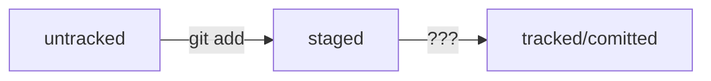

# Основы Git
## Базовые команды в консоли
### Навигация 
```pwd```    — показать рабочую дерикторию;<br>
```ls```     — отобразить содержимое дериктории;<br>
```ls -a```  — покажет скрытые файлы м папки, название которых ничинаются с ".";<br>
```cd``` — сменить дерикторию;<br>
```cd ..``` — перейти на уровень выше;<br>
```cd ~``` — перейтив домашнюю дерикторию;<br>
```cd /``` — перейтив корневую дерикторию;<br>
### Работа с файлами и папками
#### Создание
```touch index.html``` — создание файла в текущей дериктории;<br>
```touch index.html style.css script.js``` — созлание нескольких файлов;<br>
```mkdir``` — создание дериктории;<br>
#### Копирование и перемещение
```cp file.txt ~/my-dir``` — скопирует файл в другое место;<br>
```mv file.txt ~/my-dir``` — переместит файл или дерикторию в другое место;<br>
#### Чтение
```cat file.txt``` — чтение файла(распечатай содержимое текстового файла);<br>
#### Удаление 
```rm about.html``` — удаление файла;<br>
```rmdir images``` — удалить дерикторию;<br>
```rm -r``` — "recursive" удалить дерикторию и все, что она содержит;<br>
#### Полезные возможности
Команды не обязательно печатать и выполнять по очереди. Можно разделить двумя амперсандами (&&);
## Начало работы c Git
### Инициализируем репозиторий
#### Сделать дерикторию репозиторием 
```git init``` — инициализировать;<br>
```rm -rf .git``` — "разгитить" дерикторию;<br>
```git status``` — проверка состояния репозитория;<br>
### Добавление файлов в репозиторий
```git add``` — подготовить файлы к сохранению;<br>
```git add —all``` — подготовили к сохранению все файлы в репозитории;<br>
```git add .``` — добавить всю текущую дерикторию;<br>
### Делаем коммит
```git commit -m 'Мой первый коммит!'``` — создает коммит c ключом ```-m```,<br> 
который присваивает коммиту сообщение;<br>
### Просматриваем историю коммитов
```git log``` — просмотр истории коммитов;<br>
## Создаём удалённый репозиторий (GitHub)
1. Зайдите в свой профиль по ссылке https://github.com/username, <br>
где username — имя, которое вы указали при регистрации.
2. Создайте репозиторий. Название удалённого репозитория необязательно должно совпадать <br> 
с именем проекта у вас на компьютере. Но чтобы не путаться, лучше называть их одинаково.
## Генерируем SSH-ключ
### Проверка наличия SSH-ключа
```cd ~``` — перешли в домашнюю директорию;<br>
```ls -la .ssh/``` — список созданных ключей;<br>
### Инструкция по генерации SSH-ключа
1. Для генерации SSH-пары можно использовать программу ```ssh-keygen```<br>
```ssh-keygen -t ed25519 -C "email@yandex.ru"``` — Если вы видите сообщение об ошибке, то, скорее всего, <br> 
ваша система не поддерживает алгоритм шифрования ed25519.<br> 
Ничего страшного: используйте другой алгоритм;<br>
```ssh-keygen -t rsa -b 4096 -C "email@yandex.ru"``` — другой алгоритм;<br>
2. Программа запросит кодовую фразу (англ. passphrase) для доступа к SSH-ключу.
### Привязываем SSH-ключ
1. ```id_rsa.pub``` или ```id_ed25519.pub``` добавляем (публичный ключ) на удаленный ресурс (GitHub)
2. ```ssh -T git@github.com``` — проверьте правильность ключа
## Связываем локальный и удалённый репозитории
```git remote add``` — привязывает удалённый репозиторий к локальному;<br>
```git remote add origin git@github.com:%ИМЯ_АККАУНТА%/название репозитория``` — пример привязки к GitHub<br>
```git remote -v ``` — проверить, что репозитории связаны<br>
## Синхронизируем локальный и удалённый репозитории
```git push -u origin main``` — отправить изменения на удалённый репозиторий<br> 
(eсли команда приведёт к ошибке, попробуйте заменить main на master);<br>
## Хеш — идентификатор коммита
* Git преобразует информацию о коммитах с помощью алгоритма SHA-1 и для <br> 
каждого из них рассчитывает уникальный идентификатор — хеш.
* Хеш — основной идентификатор коммита и позволяет узнать его автора,<br> 
дату и содержимое закоммиченных файлов
* Все хеши, а также таблицу соответствий ```хеш → информация о коммите``` Git хранит в папке ```.git```.
### Исследуем лог
 ```git log —oneline``` — получить сокращённый лог;<br>
## Статусы файлов в Git
* ```untracked``` — неотслеживаемый;
* ```staged``` — подготовленный (то есть в списоке файлов, которые войдут в коммит);
* ```tracked``` — отслеживаемый (файлы, которые уже были зафиксированы с помощью ```git commit```);
* ```modified``` — изменённый (файл был закоммичен и после этого изменён);

## Исправить коммит
```git commit --amend``` — опция ```—amend``` работает только с последним коммитом (```HEAD```);<br>
### Дополнить коммит новыми файлами
```git commit --amend --no-edit``` — дополнить коммит новыми файлами;<br>
```
git add common.css
# добавили файл common.css в список на коммит как обычно

# но вместо команды commit -m '...'
# будет:
$ git commit --amend --no-edit

$ git log —oneline
8340eb2 Добавить главную страницу
# коммит в истории всё ещё один (но у него новый хеш) 
```
### Изменить сообщение коммита 
```git commit —amend -m "Новое сообщение"``` — изменить сообщение коммита;<br>
```
$ git commit —amend -m "Добавить главную страницу и стили"
$ git log —oneline
a31fa24 Добавить главную страницу и стили 
```
## Откатиться назад
### Выполнить unstage изменений
```git restore —staged <file>``` — переводит 'file' из ```staged``` обратно в ```untracked```;<br>
```git restore app.js``` — пример;
### Откатить коммит
```git reset —hard <commit hash>``` — откатиться до нужной версии;<br>
```git reset —hard b576d89``` — пример;
## Просмотр изменениё в файлах
```git diff``` — сравнивает последнюю закоммиченную версию файла с той, что находится в состоянии ```modified```;<br>
```git diff —staged``` — покажет изменения в ```staged```-файлах относительно последних закоммиченных версий;
## .gitignore
```git status —ignored``` — показать записи файла .gitignore;
## Клонируем репозиторий
```git clone ``` — копирует проект на локальный компьютер;<br>
```git clone https://github.com/yandex-praktikum/git-clone-lesson``` — пример;
## Форк
* «Форк» позволяет получить точную копию GitHub-репозитория в ваш аккаунт.
* Копия, которая получена с помощью «форка», полностью независима от оригинального проекта — изменения не будут синхронизированы.
# Основы работы с ветками в Git
```git branch``` — просмотреть ветки проекта. Звёздочкой (```*```) отмечено, в какой ветке вы находитесь в текущий момент ;<br>
```git branch <название_ветки>``` — создает ветку;<br>
```git checkout <название_ветки>``` — переключиться на другую ветку;<br>
```git checkout -b <название_ветки>``` — создает ветку и сразу переключиться на неё;<br>
```git branch -a``` — просматреть все доступные ветки проекта;<br>
```git diff <название_ветки1> <название_ветки2>``` — cравнить ветки;<br>
### Суффикс навигации ```~```
Например, ```HEAD~1``` — это следующий за текущим коммит. А ```main~5``` — это пятый коммит в ветке main,<br> 
если считать с последнего выполненного коммита.
## Объединяем и удаляем ветки
```git merge <название_ветки>``` —  выполнить слияние;<br>
* Перед тем как начать процесс слияния, нужно перейти в ветку, куда должны добавиться изменения. Обычно это главная ветка. Перейдите в неё и вызовите команду ```git merge``` с именем присоединяемой ветки ```feature/diff``` в качестве параметра.
### Удалить ветку после объединения
```git branch -D <название_ветки>``` — удалить ветку;<br>
```git branch -d <название_ветки>``` — удалит ветку только если она была полностью объединена с другой;<br>
```git push -u origin <название_ветки>``` — запушить ветку. (чтобы запушить ветку,  необязательно в ней находиться).
## Создать pull request
Первый способ. При создании новой ветки в удалённом репозитории Git распечатает сообщение.<br> 
Оно включает ссылку на создание пул-реквеста.
```
remote: Create a pull request for 'feat/diff' on GitHub by visiting:
remote:      https://github.com/%ВАШ_АККАУНТ%/git-branches/pull/new/feature/merge-request
```
Останется только скопировать её в адресную строку браузера, заполнить необходимые поля и нажать Create pull request (англ. «создать запрос на изменения»). Многие терминалы также позволяют кликнуть на эту ссылку — напрямую или через комбинацию Cmd / Ctrl + клик.<br>
Второй способ. Чтобы создать пул-реквест для любой существующей ветки на GitHub, перейдите на страницу репозитория, а затем выберите вкладку Pull requests в верхней части экрана.
## Забрать изменения из удалённого репозитория
```git pull``` — Забрать изменения из удалённого репозитория;<br>
Дополнительно ```git pull``` и ```git merge``` выполняют перед тем, как создать пул-реквест.<br> 
При командной работе, особенно в больших командах, основная ветка часто успевает «убежать» вперёд,<br>
пока вы подготавливаете свои изменения. Поэтому перед созданием пул-реквеста рекомендуется сначала<br> 
подтянуть изменения из основной ветки, объединить их с вашей, решить все возможные конфликты и лишь затем сделать ```push```.
```
git checkout main # перешли в main
git pull # подтянули новые изменения в main
git checkout my-branch # вернулись в рабочую ветку my-branch
git merge main # влили main в новую ветку my-branch
git push -u origin my-branch # отправили ветку my-branch в удалённый репозиторий
```
## Отвязать удаленный репозиторий
```git remote rm origin``` — эта команда удалит текущий origin;<bt>
## Fast-forward
#### Схематически результат слияния веток при fast-forward выглядит так.

### Отключить Fast-forward
```git merge --no-ff add-docs``` — отключить fast-forward;<br>
```git config [--global] merge.ff false``` — отключить «навсегда» fast-forward;<br>
#### Схематически результат слияния веток при отключенном fast-forward выглядит так.
